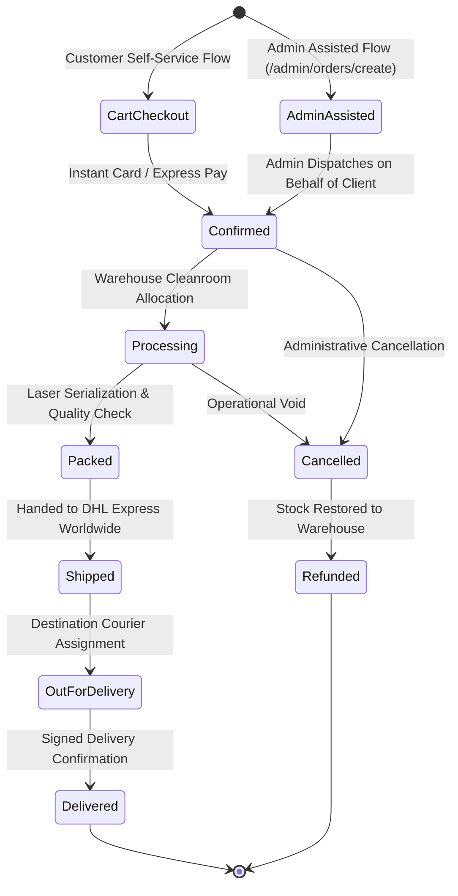
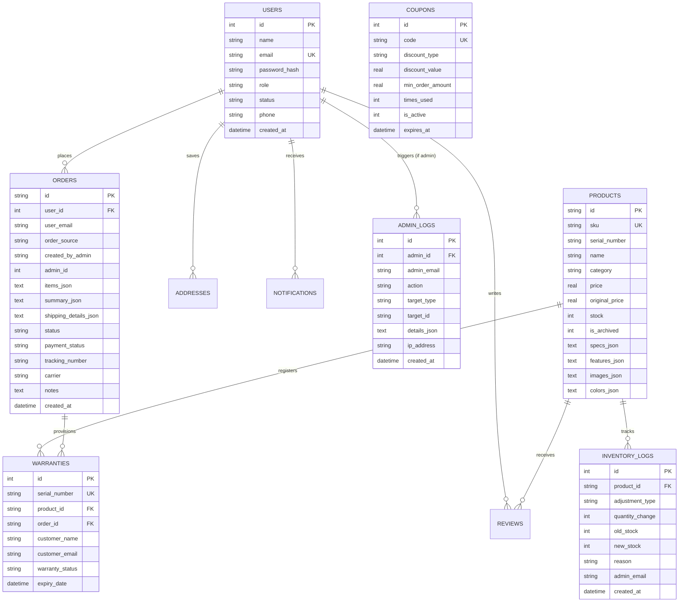

# Aura — Enterprise Luxury Hardware & Universal Commerce Platform

[](https://aura-e-commerce-8uxz.vercel.app)
[](https://react.dev/)
[](https://vitejs.dev/)
[](https://tailwindcss.com/)
[](https://expressjs.com/)
[-336791?style=for-the-badge&logo=sqlite&logoColor=white)](https://sqlite.org/)
[](https://jwt.io/)

> **Aura** is a full-stack, enterprise-grade e-commerce application and luxury hardware operations management platform. Engineered to mirror the design language, product clarity, and operational rigor of premium consumer technology brands (Apple, Teenage Engineering, Bang & Olufsen, Nothing), Aura delivers a synchronized ecosystem spanning customer shopping, real-time audio synthesis, multi-currency commerce, and a protected administrative back-office with server-validated order generation.

---

## 🔗 Quick Links

- **Live Production URL**: [https://aura-e-commerce-8uxz.vercel.app](https://aura-e-commerce-8uxz.vercel.app)
- **GitHub Repository**: [https://github.com/shovonmahmud733-png/Aura-e-commerce](https://github.com/shovonmahmud733-png/Aura-e-commerce)
- **API Health Check**: [`https://aura-e-commerce-8uxz.vercel.app/api/health`](https://aura-e-commerce-8uxz.vercel.app/api/health)

---

## 📑 Table of Contents

1. [Executive Overview & Highlights](#-executive-overview--highlights)
2. [Demo Access Credentials](#-demo-access-credentials)
3. [Feature Matrix](#-feature-matrix)
4. [Customer Experience Deep Dive](#-customer-experience-deep-dive)
   - [Storefront & Hardware Showcase](#storefront--hardware-showcase)
   - [Acoustic Synthesizer (Web Audio API)](#acoustic-synthesizer-web-audio-api)
   - [Product Comparison Matrix](#product-comparison-matrix)
   - [Shopping Bag, Checkout & Test Mode](#shopping-bag-checkout--test-mode)
   - [Official PDF Tax Invoice Generator](#official-pdf-tax-invoice-generator)
   - [Order Consignment & Live DHL Stepper](#order-consignment--live-dhl-stepper)
   - [Customer Account Portal](#customer-account-portal)
   - [Aura AI Hardware Concierge](#aura-ai-hardware-concierge)
5. [Enterprise Admin Operations Platform](#-enterprise-admin-operations-platform)
   - [Command Dashboard & Real-Time Telemetry](#command-dashboard--real-time-telemetry)
   - [Global Command Search (`Ctrl+K`)](#global-command-search-ctrlk)
   - [Product Catalog Studio & Soft-Delete Archiving](#product-catalog-studio--soft-delete-archiving)
   - [Stock & Warehouse Control (`/admin/inventory`)](#stock--warehouse-control-admininventory)
   - [Fulfillment & Order Lifecycle](#fulfillment--order-lifecycle)
   - [Admin-Assisted Order Creation Engine](#admin-assisted-order-creation-engine)
   - [Customer Directory & Access Control](#customer-directory--access-control)
   - [Review Moderation Queue](#review-moderation-queue)
   - [Promotions & Coupon Engine](#promotions--coupon-engine)
   - [Hardware Warranty Registry](#hardware-warranty-registry)
   - [Commercial Analytics & Intelligence](#commercial-analytics--intelligence)
   - [Store Settings & System Audit Logs](#store-settings--system-audit-logs)
6. [Order Lifecycle & Workflow Architecture](#-order-lifecycle--workflow-architecture)
7. [System Architecture](#-system-architecture)
8. [Database Schema & Relationships](#-database-schema--relationships)
9. [REST API Documentation](#-rest-api-documentation)
10. [Repository Directory Structure](#-repository-directory-structure)
11. [Technology Stack](#-technology-stack)
12. [Installation & Local Setup](#-installation--local-setup)
13. [Environment Variables](#-environment-variables)
14. [Security Architecture](#-security-architecture)
15. [Performance & Engineering Optimizations](#-performance--engineering-optimizations)
16. [Testing & Quality Assurance](#-testing--quality-assurance)
17. [Roadmap](#-roadmap)
18. [Known Limitations](#-known-limitations)
19. [Contributing](#-contributing)
20. [License](#-license)
21. [Author & Maintainer](#-author--maintainer)

---

## ⚡ Executive Overview & Highlights

Aura operates as a unified single-repository full-stack system. Rather than relying on generic e-commerce templates, Aura combines custom client-side micro-interactions with an Express REST API and a relational SQLite database backed by `sql.js` (with automatic disk persistence and Vercel serverless synchronization).

### Core Architectural Highlights
- **Hardware-First Consumer Tech Positioning**: Precision-tuned typography, subtle dark luxury gradients, laser-etched hardware serial number badges, and bespoke component architecture.
- **Dual-Portal Role-Based Access Control (RBAC)**: Secure separation between public customer shopping and authenticated operations management via JSON Web Tokens (`jwt`) and `bcryptjs` password hashing.
- **Dedicated Admin-Assisted Order Creation**: Full-featured administrative workflow allowing operators to build and dispatch manual orders on behalf of existing verified customers without compromising buyer attribution.
- **Zero Fabrication Telemetry**: Dashboard KPIs, revenue curves, and stock statistics are derived dynamically from live SQLite database records.
- **In-Browser Acoustic Simulation**: Real-time Web Audio API signal processing synthesizer modeling Standard, Active Noise Cancellation (-42dB), and Spatial Audio with dynamic frequency spectrum visualization.
- **Global Currency Engine**: Instant client-side currency translation across 6 global denominations (**USD**, **EUR**, **GBP**, **JPY**, **CAD**, **BDT**) with locale-aware symbol formatting.
- **Laser-Etched Hardware Warranty System**: Automated provisioning of authentic 2-Year Global Protection warranties with unique serial numbers (`AUR-HW-XXXX`) on every hardware purchase.
- **1-Page Print-Ready Tax Invoices**: Sandboxed printable PDF invoice generation with corporate EIN (`US-EIN 84-2910394`), sequential invoice numbering, itemized sub-totals, and CSS print media stylesheets.

---

## 🔑 Demo Access Credentials

The SQLite database is pre-seeded with verified test accounts:

| Role | Email | Password | Access Level | Primary Scope |
| :--- | :--- | :--- | :--- | :--- |
| **Enterprise Administrator** | `admin@gmail.com` | `admin@@11` | Full Administrative Privileges | `/admin/*` (Product CRUD, Inventory, Orders, Users, Analytics, Audit Logs) |
| **Verified Customer** | `alex@auracommerce.io` | `Demo1234!` | Authenticated Shopper | `/account/*` (Orders, DHL Stepper, Wishlist, Addresses, Reviews, Warranties) |

> 💡 **Quick Fill**: The authentication modal provides **Fill Customer** and **Fill Admin** one-click buttons to populate credentials instantly during demonstrations. New customer accounts can also be created dynamically via the registration tab.

---

## 📊 Feature Matrix

| Functional Module | Customer Storefront | Customer Portal (`/account`) | Enterprise Admin (`/admin`) | Database Model | Status |
| :--- | :---: | :---: | :---: | :--- | :--- |
| **Product Browsing & Search** | ✅ | ✅ | ✅ | `products` | **Implemented** |
| **Category & Spec Filtering** | ✅ | — | ✅ | `products` | **Implemented** |
| **Acoustic Audio Synthesizer** | ✅ | — | — | Web Audio API | **Implemented** |
| **Hardware Specification Comparison** | ✅ | — | — | Client-side Matrix | **Implemented** |
| **Multi-Currency Engine (6 Currencies)**| ✅ | ✅ | ✅ | `formatters.js` | **Implemented** |
| **Shopping Bag & Cart Management** | ✅ | — | — | `StoreContext` / LocalStorage | **Implemented** |
| **Checkout & Simulated Stripe Gateway** | ✅ | — | — | `orders` | **Implemented** |
| **Order Placement (Self-Checkout)** | ✅ | — | — | `orders` | **Implemented** |
| **Order Consignment Tracking (DHL Stepper)** | ✅ | ✅ | ✅ | `orders` | **Implemented** |
| **Tax Invoice PDF Generator** | ✅ | ✅ | ✅ | `invoicePrinter.js` | **Implemented** |
| **Customer Wishlist** | ✅ | ✅ | — | LocalStorage Sync | **Implemented** |
| **Customer Profile & Password Change**| — | ✅ | — | `users` | **Implemented** |
| **Saved Delivery Addresses** | — | ✅ | ✅ (Inspector) | `addresses` | **Implemented** |
| **Customer Product Reviews** | ✅ (Read) | ✅ (Submit) | ✅ (Moderate) | `reviews` | **Implemented** |
| **Hardware Warranty Claims & Verification**| ✅ (Verify) | ✅ (View/Register)| ✅ (Manage Status) | `warranties` | **Implemented** |
| **AI Shopping Concierge (Voice + NLP)** | ✅ | — | — | `conciergeEngine.js` | **Implemented** |
| **Global Command Search (`Ctrl+K`)** | — | — | ✅ | Multi-Entity DB Query | **Implemented** |
| **Admin-Assisted Order Generation** | — | — | ✅ | `orders` + `admin_logs` | **Implemented** |
| **Catalog CRUD & Soft-Delete Archiving**| — | — | ✅ | `products` | **Implemented** |
| **Warehouse Inventory Logs & Adjustments**| — | — | ✅ | `inventory_logs` | **Implemented** |
| **Customer Directory & Access Suspension**| — | — | ✅ | `users` | **Implemented** |
| **Promotions & Promo Codes Engine** | ✅ (Apply) | — | ✅ (Full CRUD) | `coupons` | **Implemented** |
| **Commercial Analytics & Revenue Charts**| — | — | ✅ | Live Computed Aggregates | **Implemented** |
| **Immutable System Audit Logging** | — | — | ✅ | `admin_logs` | **Implemented** |

---

## 🛍️ Customer Experience Deep Dive

### Storefront & Hardware Showcase
- **Hero & Motion Choreography**: Built with high-end dark luxury styling, featuring subtle entrance motion, a slow animated luxury gradient badge, and responsive typography.
- **Product Catalog Grid (`/products`)**: Displays hardware catalog items with stock status indicators (`In Stock`, `Low Stock`, `Out of Stock`), customer star ratings, category filters, and price/rating sorting.
- **Interactive Product Detail Modal & Page (`/product/:id`)**:
  - Image gallery switching with color variant coordination (e.g. Space Black, Platinum Silver, Midnight Navy).
  - Key specification badges (Drivers, Battery, Connectivity, Weight).
  - Hover zoom lens for macro-inspection of hardware finishes.
  - Interactive color pill selector that updates the hero image and variant SKU.
  - Sticky mobile buy bar for conversion retention across small screens.

### Acoustic Synthesizer (Web Audio API)
Embedded inside audio product presentations (`AudioDemoPlayer.jsx`), Aura runs an in-browser audio engine using the native Web Audio API (`window.AudioContext`):
- **Modes**: Toggles live between **Standard Audio**, **Active Noise Cancellation (-42dB)** (applying high-pass and notch filtering to simulate environmental noise rejection), and **3D Spatial Audio** (applying parametric stage widening).
- **Canvas Frequency Spectrum Visualizer**: Animated real-time 24-band frequency bar spectrum powered by `requestAnimationFrame`.

### Product Comparison Matrix (`/compare`)
- Allows side-by-side technical evaluation of up to 3 hardware products.
- Compares pricing, ratings, acoustic drivers, frequency response, battery life, chassis materials, wireless standards, and warranty coverage with difference highlighting.

### Shopping Bag, Checkout & Test Mode
- **Persistent Slide-Over Bag Drawer (`CartDrawer.jsx`)**: Instant quantity steppers, item removal, complimentary express courier threshold calculation ($500+), and subtotal computation.
- **Checkout Modal (`CheckoutModal.jsx`)**:
  - Direct delivery address capture or pre-population from authenticated account addresses.
  - Shipping courier selection: **DHL Express Worldwide** (Standard / Complimentary over $500) vs. **DHL Express Priority Air** ($25.00).
  - Coupon code input with real-time validation against the SQLite `coupons` table.
  - Maximum checkout ceiling enforcement (5 units max per consumer checkout to prevent bulk unauthorized reselling).
  - Credit Card input with automated card brand detection (**Visa**, **Mastercard**, **Amex**) and a 1-click **Test Card Auto-Fill** (`4242 4242 4242 4242`).
  - Express checkout buttons for simulated **Apple Pay** and **Google Pay**.

### Official PDF Tax Invoice Generator
Triggered automatically on order completion, from customer order history, and from the admin order inspector via `printInvoiceDirectly()` in `src/utils/invoicePrinter.js`:
- Sandboxed invisible `iframe` print execution targeting `@media print`.
- Itemized SKU consignment list with laser-etched hardware serial numbers.
- Verified corporate entity header (`Aura Technologies Inc., US-EIN 84-2910394`).
- Sequential tax invoice numbering format (`INV-2026-XXXXXX`).
- Financial reconciliation breakdown: Net Subtotal, Applied Promotions, Express Shipping, State/Sales Tax (8%), and Gross Settled Total.

### Order Consignment & Live DHL Stepper
Integrated in both customer orders (`/orders`, `/account/orders/:id`) and administrative consignment control (`/admin/orders/:id`):
- Visual 5-stage courier progress timeline:
  1. `Order Verified` (Consignment confirmed and payment settled)
  2. `Facility Prep` (Cleanroom inspection & packaging)
  3. `In Transit` (Air cargo dispatch via DHL Express Worldwide)
  4. `Out for Delivery` (Local courier vehicle assignment)
  5. `Delivered` (Signed delivery confirmation)
- Real-time consignment tracking numbers (`DHL-AUR-XXXXXXXX`) with 1-click clipboard copying.

### Customer Account Portal
Guarded by `ProtectedRoute.jsx` and verified against backend session JWTs:
- **`/account` (Overview)**: Summary metrics (Total Orders, Total Spent, Active Warranties, Saved Wishlist), active shipment progress tracker, and quick navigational links.
- **`/account/profile`**: Name, phone, and secure password update form requiring current password verification.
- **`/account/orders` & `/account/orders/:id`**: Complete purchase history, line-item serial numbers, "Buy Again" re-cart action, and tax invoice printing.
- **`/account/wishlist`**: Saved hardware bookmarks with instant one-click transfer to cart.
- **`/account/reviews`**: Verified customer review submission with 1–5 star ratings, headline, and comment logging.
- **`/account/addresses`**: Delivery destination address book supporting default address designation.
- **`/account/warranty`**: Device serial number registry with coverage status and expiry countdowns.
- **`/account/settings`**: System appearance toggle (Dark Mode / Light Mode), global commerce currency preference selector, and 2FA authentication toggle.

### Aura AI Hardware Concierge
Floating omni-present interactive assistant (`AiConcierge.jsx`) backed by `conciergeEngine.js`:
- Answers detailed engineering questions regarding acoustic drivers, titanium casing, battery hours, and water resistance.
- Supports browser-native **Voice Input** using the Web Speech Recognition API (`webkitSpeechRecognition`).
- Renders interactive in-chat product recommendation cards with direct "Add to Bag" triggers.
- Provides contextual multi-currency pricing conversion and live DHL tracking lookup.

---

## 🛡️ Enterprise Admin Operations Platform

The administrative dashboard (`/admin/*`) is isolated behind strict middleware guards ([`requireAdmin`](file:///d:/antiboss/server/middleware/authMiddleware.js) and [`AdminRoute.jsx`](file:///d:/antiboss/src/components/AdminRoute.jsx)). Unauthorized requests are rejected with HTTP 403 Forbidden.

### Command Dashboard & Real-Time Telemetry
- **Dynamic KPI Telemetry**: Real-time Gross Merchandise Value (GMV), Total Consignments, Registered Customers, and Low Stock Watchlist alerts.
- **Live Status Selector**: Inline order fulfillment status updates directly from the dashboard table.
- **System Activity Feed**: Audit trail stream displaying the most recent administrative mutations.

### Global Command Search (`Ctrl+K`)
Keyboard-driven universal search palette querying across 4 database entities simultaneously:
- **Products**: Matches by product title, SKU, or hardware serial prefix.
- **Orders**: Matches by order ID, customer name, email, or DHL tracking number.
- **Customers**: Matches by name, email, or customer user ID.
- **Coupons**: Matches by promotional code.

### Product Catalog Studio & Soft-Delete Archiving
- Complete CRUD interface at `/admin/products/new` and `/admin/products/:id/edit`.
- Dynamic key-value technical specifications builder (Frequency Range, Battery Life, Chassis Materials, Wireless Protocol).
- **Safe Soft-Delete Archiving (`is_archived`)**: Products can be archived without breaking historical customer orders or relational integrity, with full restoration capability.

### Stock & Warehouse Control (`/admin/inventory`)
- Real-time inventory tracking with threshold badges (`In Stock`, `Low Stock ≤ 5`, `Out of Stock`).
- Quick-increment adjustment triggers (`-1`, `+1`, `+5`, `+20`).
- **Audit-Logged Stock Adjustments**: Every manual adjustment records an immutable row in `inventory_logs` with operational reason tagging (`restock`, `damage`, `correction`, `return`, `sale`) and operator attribution.
- Prevents negative inventory states via database-level validation.

### Fulfillment & Order Lifecycle
- **Order Consignment Management (`/admin/orders/:id`)**:
  - Carrier updates (**DHL Express Worldwide**, **DHL Express Priority Air**, **FedEx International Priority**).
  - Consignment tracking code generation and estimated arrival dates.
  - Multi-stage lifecycle state engine: `Confirmed` $\rightarrow$ `Processing` $\rightarrow$ `Packed` $\rightarrow$ `Shipped` $\rightarrow$ `Out for Delivery` $\rightarrow$ `Delivered`.
  - **Order Cancellation & Stock Restoration**: Multi-stage cancellation modal with audit justification logging and automated inventory restoration.
  - Operational audit memo log: Admin internal notes appended to the order ledger with timestamps and admin identification.

### Admin-Assisted Order Creation Engine
Located at `/admin/orders/create` (accessible via **Admin Panel → Orders → `+ Create Order`**), this dedicated enterprise feature enables authorized administrators to generate orders on behalf of existing clients.

#### Business Logic & Attribution Rules
- **Strict Role Attribution**:
  - **Admin = Operator / Creator** (`order.orderSource = 'ADMIN_CREATED'`, `order.createdByAdmin = adminIdentifier`, `order.adminId = adminUser.id`).
  - **Customer = Buyer / Order Owner** (`order.userId = customer.id`, `order.userEmail = customer.email`, `order.shippingDetails = customerAddress`).
- **Storefront Isolation**: Admins are never redirected to the storefront shopping bag or customer checkout flow.
- **Customer Portal Visibility**: Orders created through this flow appear immediately in the selected customer's portal (`/account/orders`) and are fully trackable by the customer.

#### 5-Step Order Generation Workflow
1. **Select Existing Customer**: Search customer directory by name, email, or phone. Arbitrary or non-existent customer IDs are rejected by the backend.
2. **Select Hardware & Variants**: Live product search with stock availability indicators. Quantity steppers prevent requesting quantities exceeding available inventory.
3. **Delivery Destination**: Auto-populates stored addresses from the customer's profile or accepts custom shipping coordinates; courier selection determines shipping fees.
4. **Payment & Operational Terms**: Validates active promotional coupons, applies payment methods (Stripe, Corporate Bank Wire, Purchase Order, Manual Invoice, COD), sets settlement status (`Paid`, `Pending`, `Authorized`), and captures internal operational notes.
5. **Review & Dispatch**: Displays server-calculated subtotal, courier shipping, tax, and total. On submission, the backend:
   - Validates live stock and decrements inventory in SQLite.
   - Records audit entry in `inventory_logs`.
   - Registers authentic 2-Year hardware warranties in `warranties`.
   - Logs `CREATE_ORDER` event in `admin_logs`.
   - Returns instant printable invoice and tracking receipt.

### Customer Directory & Access Control
- Directory view at `/admin/customers` with live total spend and order count telemetry.
- **Account Suspension Toggle**: Instant one-click toggle to suspend (`disabled`) or activate (`active`) shopper accounts. Suspended accounts are barred from authentication by backend middleware.
- **Role Elevation**: One-click promotion/demotion between `customer` and `admin`.
- **Customer Inspector (`/admin/customers/:id`)**: Comprehensive dossier showing lifetime expenditure, registered addresses, order history, written reviews, and active hardware warranties.

### Review Moderation Queue
- Centralized review management at `/admin/reviews`.
- Filter reviews by moderation state: `All`, `Approved`, `Pending`, `Rejected`.
- Approve, Reject, or Delete customer reviews with immediate storefront catalog rating re-calculation.

### Promotions & Coupon Engine
- Management interface at `/admin/coupons`.
- Create, modify, and delete promotional campaigns.
- Supports percentage discounts (e.g. `SAVE20` = 20% off) and fixed amount discounts (e.g. `FREESHIP` = $25.00 off).
- Configurable minimum order spend thresholds, maximum discount caps, usage limits, and active status toggles.

### Hardware Warranty Registry
- Centralized device registry at `/admin/warranty`.
- Live serial lookup across all provisioned hardware.
- Status management (`Active`, `Claim Under Review`, `Claim Approved`, `Expired`, `Void`).

### Commercial Analytics & Intelligence
- Time-series analytics at `/admin/analytics` with range selectors: **7 Days**, **30 Days**, **90 Days**, and **1 Year**.
- Real-time dynamic metrics: Gross Merchandise Value (GMV), Total Completed Orders, Average Order Value (AOV), and Sales Conversion Rate.
- Category sales breakdown bars and top-performing hardware leaderboard.

### Store Settings & System Audit Logs
- Store parameters editor at `/admin/settings` (Store Name, Support Hotline, Currency, Sales Tax Rate, Free Shipping Threshold, Default Courier).
- **Immutable Audit Feed**: Searchable log table recording admin actor, action verb (`CREATE_ORDER`, `ORDER_CANCELLED`, `PRODUCT_ARCHIVED`, `STOCK_ADJUSTED`, `SETTINGS_UPDATED`), target entity ID, IP address, and timestamp.

---

## 🔄 Order Lifecycle & Workflow Architecture



### Order Flow Comparison

```
1. Customer Self-Checkout:
Storefront Browse → Bag Drawer → Checkout Modal → Stripe Elements → SQLite createOrder() → Stock Decremented → Warranty Registered → Confirmation & Tax Invoice

2. Admin-Assisted Order Generation:
Admin (/admin/orders/create) → Verify Existing Customer → Select Hardware → Validate Live Stock → Backend calculateAdminOrderPreview() → Apply Terms/Coupon → SQLite createAdminOrder() → Order Attributed to Customer → Admin Logged as Operator → Stock Decremented → Warranty Provisioned → Tax Receipt
```

---

## 🏛️ System Architecture

```mermaid
flowchart TD
    subgraph Client Layer
        Browser[Modern Web Browser / Mobile Device]
        StorefrontUI[React 18 Storefront & Audio Synthesizer]
        CustomerPortal[Customer Portal /account/*]
        AdminPortal[Enterprise Admin Panel /admin/*]
    end

    subgraph State & API Client
        StoreContext[StoreContext Provider & LocalStorage Sync]
        ApiService[apiService.js Unified Client]
    end

    subgraph Server Layer - Node / Express
        ExpressServer[Express REST API - Port 5000 / Vercel Serverless]
        AuthMiddleware[JWT & Role-Based Auth Middleware]
        AuthRouter[/api/auth Router]
        ProductsRouter[/api/products Router]
        OrdersRouter[/api/orders Router]
        AccountRouter[/api/account Router]
        AdminRouter[/api/admin Router]
    end

    subgraph Database Layer - SQLite 3
        SqlJs[sql.js In-Memory SQLite Engine]
        DiskSync[database.sqlite Disk / Vercel Tmp Storage]
        Tables[(12 Relational Tables)]
    end

    Browser --> StorefrontUI & CustomerPortal & AdminPortal
    StorefrontUI & CustomerPortal & AdminPortal --> StoreContext
    StoreContext --> ApiService
    ApiService --> ExpressServer

    ExpressServer --> AuthRouter & ProductsRouter & OrdersRouter & AccountRouter & AdminRouter
    AccountRouter & AdminRouter --> AuthMiddleware

    AuthRouter & ProductsRouter & OrdersRouter & AccountRouter & AdminRouter --> SqlJs
    SqlJs <--> DiskSync
    SqlJs --> Tables
```

---

## 🗄️ Database Schema & Relationships

Aura uses a relational SQLite database initialized and managed through `server/db.js` with automatic schema migrations.



### Table Dictionary (12 Core Entities)

1. **`users`**: Customer profiles and administrator accounts (stores bcrypt password hashes, account status, role).
2. **`otps`**: Verification records for two-factor / email authentication codes with expiration timestamps.
3. **`products`**: Catalog items (SKU, serial prefix, pricing, live stock, soft-delete archiving status, JSON specs, colors).
4. **`orders`**: Master consignment ledger (line items, financials, customer attribution, admin operator attribution, fulfillment status, DHL tracking numbers).
5. **`addresses`**: Saved delivery coordinates associated with customer accounts.
6. **`coupons`**: Promotional campaigns (percentage/fixed amounts, minimum order requirements, usage limits, counters).
7. **`reviews`**: Product ratings and feedback with moderation status (`approved`, `pending`, `rejected`).
8. **`warranties`**: Provisioned 2-Year hardware warranty registry tracking authentic device serial numbers.
9. **`admin_logs`**: System audit log capturing all administrative actions, targets, details, and actor emails.
10. **`inventory_logs`**: Warehouse stock adjustment audit trail tracking quantity deltas and business reasons.
11. **`store_settings`**: Global store configuration parameters (tax rate, free shipping threshold, courier defaults).
12. **`notifications`**: Customer and system alert messages with unread/read state tracking.

---

## 📡 REST API Documentation

All administrative endpoints require a valid JWT bearer token with an authorized role (`admin`, `super_admin`).

### Authentication (`/api/auth`)
| Method | Endpoint | Description | Access Level |
| :--- | :--- | :--- | :--- |
| `POST` | `/api/auth/register` | Register new customer account (hashes password with bcrypt) | Public |
| `POST` | `/api/auth/login` | Authenticate customer or administrator and return JWT | Public |
| `GET` | `/api/auth/me` | Validate JWT session and return authenticated user profile | Authenticated |
| `POST` | `/api/auth/forgot-password` | Request password reset instructions | Public |

### Storefront Products (`/api/products`)
| Method | Endpoint | Description | Access Level |
| :--- | :--- | :--- | :--- |
| `GET` | `/api/products` | Retrieve active hardware catalog (supports `?category=`, `?search=`, `?sort=`) | Public |
| `GET` | `/api/products/:id` | Fetch comprehensive single product specification and details | Public |

### Customer Orders (`/api/orders`)
| Method | Endpoint | Description | Access Level |
| :--- | :--- | :--- | :--- |
| `POST` | `/api/orders` | Place consumer order (validates cart, decrements stock, creates warranty) | Customer |
| `GET` | `/api/orders/my-orders` | Fetch historical order list for authenticated shopper | Customer |

### Customer Account Portal (`/api/account`)
| Method | Endpoint | Description | Access Level |
| :--- | :--- | :--- | :--- |
| `GET` | `/api/account/profile` | Retrieve user profile and aggregated spending/warranty statistics | Customer |
| `PUT` | `/api/account/profile` | Update profile information and change account password | Customer |
| `GET` | `/api/account/orders` | Retrieve authenticated user's order history | Customer |
| `GET` | `/api/account/orders/:id` | Fetch specific order details (with ownership access verification) | Customer |
| `GET` | `/api/account/addresses` | Fetch saved delivery addresses | Customer |
| `POST` | `/api/account/addresses` | Add new saved address | Customer |
| `PUT` | `/api/account/addresses/:id` | Update existing address | Customer |
| `DELETE`| `/api/account/addresses/:id`| Remove address from address book | Customer |
| `GET` | `/api/account/reviews` | Retrieve reviews authored by user | Customer |
| `POST` | `/api/account/reviews` | Submit new product review | Customer |
| `GET` | `/api/account/warranties` | Retrieve registered hardware warranties for user | Customer |
| `GET` | `/api/account/notifications` | Fetch customer notification inbox | Customer |
| `PUT` | `/api/account/notifications/:id/read` | Mark specific notification as read | Customer |
| `GET` | `/api/account/coupons` | Retrieve active public discount coupons | Customer |

### Enterprise Admin Operations (`/api/admin`)
| Method | Endpoint | Description | Access Level |
| :--- | :--- | :--- | :--- |
| `GET` | `/api/admin/overview` | Fetch live KPI metrics (Gross Revenue, Orders, Customers, Low Stock) | Admin |
| `GET` | `/api/admin/analytics` | Fetch commercial performance dataset (`?range=7D\|30D\|90D\|1Y`) | Admin |
| `GET` | `/api/admin/search` | Multi-entity global search across products, orders, users, coupons | Admin |
| `GET` | `/api/admin/products` | Retrieve catalog items including archived products | Admin |
| `GET` | `/api/admin/products/:id`| Retrieve single product for editor | Admin |
| `POST` | `/api/admin/products` | Create new hardware SKU | Admin |
| `PUT` | `/api/admin/products/:id`| Update product attributes, images, specs | Admin |
| `PUT` | `/api/admin/products/:id/archive` | Soft-delete product from active storefront | Admin |
| `PUT` | `/api/admin/products/:id/restore` | Restore archived product to active catalog | Admin |
| `DELETE`| `/api/admin/products/:id`| Permanently remove product from database | Admin |
| `PUT` | `/api/admin/products/:id/stock` | Directly set product stock level | Admin |
| `GET` | `/api/admin/inventory` | Inventory status table with low stock warnings | Admin |
| `POST` | `/api/admin/inventory/adjust` | Adjust stock with operational audit reason logging | Admin |
| `GET` | `/api/admin/inventory/logs` | Fetch inventory adjustment audit log | Admin |
| `GET` | `/api/admin/orders` | Fetch all orders across system with filtering | Admin |
| `POST` | `/api/admin/orders/calculate` | Server-side calculation preview for order creator | Admin |
| `POST` | `/api/admin/orders` | **Admin-Assisted Order Creation** on behalf of client | Admin |
| `GET` | `/api/admin/orders/:id` | Order consignment details and shipping inspector | Admin |
| `PUT` | `/api/admin/orders/:id/status` | Update order milestone (`Confirmed` $\rightarrow$ `Delivered`) and tracking | Admin |
| `PUT` | `/api/admin/orders/:id/cancel` | Cancel order and automatically restore warehouse inventory | Admin |
| `PUT` | `/api/admin/orders/:id/notes` | Append internal administrative memo notes | Admin |
| `PUT` | `/api/admin/orders/:id/payment`| Update payment settlement status | Admin |
| `GET` | `/api/admin/customers` | Retrieve customer directory with spend and order counts | Admin |
| `GET` | `/api/admin/customers/:id`| Retrieve comprehensive customer dossier and history | Admin |
| `PUT` | `/api/admin/customers/:id/status` | Suspend or activate customer account access | Admin |
| `PUT` | `/api/admin/customers/:id/role` | Elevate or demote user role (`user` $\leftrightarrow$ `admin`) | Admin |
| `GET` | `/api/admin/reviews` | Fetch reviews awaiting moderation | Admin |
| `PUT` | `/api/admin/reviews/:id/status` | Approve or reject review | Admin |
| `DELETE`| `/api/admin/reviews/:id`| Delete review | Admin |
| `GET` | `/api/admin/coupons` | Fetch all promotional discount codes | Admin |
| `POST` | `/api/admin/coupons` | Create new percentage or fixed promo code | Admin |
| `PUT` | `/api/admin/coupons/:id`| Update coupon rules and active state | Admin |
| `DELETE`| `/api/admin/coupons/:id`| Delete coupon | Admin |
| `GET` | `/api/admin/warranties` | Hardware warranty registry lookup | Admin |
| `PUT` | `/api/admin/warranties/:id`| Update warranty claim status | Admin |
| `GET` | `/api/admin/settings` | Retrieve store parameters and configuration | Admin |
| `PUT` | `/api/admin/settings` | Update store parameters | Admin |
| `GET` | `/api/admin/notifications` | Fetch administrative action alerts (low stock, claims) | Admin |
| `GET` | `/api/admin/logs` | Fetch immutable administrative audit log stream | Admin |

### System Health
| Method | Endpoint | Description | Access Level |
| :--- | :--- | :--- | :--- |
| `GET` | `/api/health` | Health check returning service status and timestamp | Public |

---

## 📂 Repository Directory Structure

```
aura-e-commerce/
├── api/
│   └── index.js                        # Vercel serverless API entrypoint
├── public/
│   ├── favicon.svg                     # Aura geometric brand mark
│   └── images/
│       └── products/                   # High-resolution hardware photography
│           ├── diffuser-stone.jpg
│           ├── diffuser-white.jpg
│           ├── fitness-band-black.jpg
│           ├── fitness-band-moss.jpg
│           ├── headphones-black.jpg
│           ├── headphones-navy.jpg
│           ├── headphones-silver.jpg
│           ├── smart-ring-black.jpg
│           ├── smart-ring-gold.jpg
│           ├── smart-ring-silver.jpg
│           ├── smartwatch-black.jpg
│           ├── smartwatch-rosegold.jpg
│           ├── smartwatch-titanium.jpg
│           ├── stands-black.jpg
│           └── stands-titanium.jpg
├── server/
│   ├── index.js                        # Express server entrypoint & router mounts
│   ├── db.js                           # SQLite 3 engine, migrations, seeds, queries
│   ├── auth.js                         # Authentication router (/api/auth)
│   ├── productsRouter.js               # Storefront products router (/api/products)
│   ├── ordersRouter.js                 # Customer orders router (/api/orders)
│   ├── accountRouter.js                # Customer portal router (/api/account)
│   ├── adminRouter.js                  # Enterprise operations router (/api/admin)
│   ├── schema.sql                      # Optional PostgreSQL schema reference
│   ├── cloudDb.js                      # Cloud database connector abstraction
│   ├── emailService.js                 # Email dispatch service stub
│   └── middleware/
│       └── authMiddleware.js           # JWT authentication & admin RBAC guards
├── src/
│   ├── main.jsx                        # React root entrypoint
│   ├── App.jsx                         # Main router & modal providers
│   ├── index.css                       # Tailwind directives, animations & print CSS
│   ├── components/
│   │   ├── AdminRoute.jsx              # Role guard for /admin/*
│   │   ├── ProtectedRoute.jsx          # Session guard for /account/*
│   │   ├── Navbar.jsx                  # Header with search, currency, cart triggers
│   │   ├── Footer.jsx                  # Brand footer & navigation
│   │   ├── AuthModal.jsx               # Sign in / Register modal with quick fills
│   │   ├── CartDrawer.jsx              # Slide-over shopping bag drawer
│   │   ├── WishlistDrawer.jsx          # Slide-over saved wishlist drawer
│   │   ├── CheckoutModal.jsx           # Order checkout & card payment modal
│   │   ├── OrderConfirmationModal.jsx  # Post-purchase receipt with invoice print
│   │   ├── ProductCard.jsx             # Grid hardware card with hover lens
│   │   ├── ProductDetailModal.jsx      # Quick-view product modal
│   │   ├── AudioDemoPlayer.jsx         # Web Audio API acoustic demo player
│   │   ├── AiConcierge.jsx             # Floating AI shopping concierge
│   │   ├── DeliveryEstimator.jsx       # Delivery date calculator component
│   │   ├── MobileStickyBuyBar.jsx      # Mobile sticky bottom conversion bar
│   │   ├── RecentlyViewed.jsx          # Browsing history recommendations
│   │   ├── LoadingSkeleton.jsx         # Skeleton loaders for async data
│   │   └── Toast.jsx                   # Global notification toaster
│   ├── context/
│   │   └── StoreContext.jsx            # Global commerce & authentication state
│   ├── data/
│   │   └── products.js                 # Default hardware product catalog data
│   ├── hooks/
│   │   └── useInView.js                # Intersection observer hook for motion
│   ├── pages/
│   │   ├── HomePage.jsx                # Luxury landing page & product showcase
│   │   ├── ProductsPage.jsx            # Catalog filtering & sort matrix
│   │   ├── ProductDetailPage.jsx       # Full-page hardware specification view
│   │   ├── OrdersPage.jsx              # Public order lookup & tracking
│   │   ├── ComparePage.jsx             # 3-way specification comparison matrix
│   │   ├── WarrantyPage.jsx            # Public warranty & serial verification
│   │   ├── ContactPage.jsx             # Support center, FAQs & message dispatch
│   │   ├── NotFoundPage.jsx            # 404 luxury fallback view
│   │   ├── account/                    # Customer account portal (/account/*)
│   │   │   ├── AccountLayout.jsx       # Account sidebar navigation
│   │   │   ├── AccountOverviewPage.jsx # KPIs, recent shipment progress
│   │   │   ├── AccountProfilePage.jsx  # Name, phone, password update
│   │   │   ├── AccountOrdersPage.jsx   # Consignment history list
│   │   │   ├── AccountOrderDetailPage.jsx # Itemized tracking & receipt
│   │   │   ├── AccountWishlistPage.jsx # Saved luxury hardware grid
│   │   │   ├── AccountReviewsPage.jsx  # Customer authored review cards
│   │   │   ├── AccountAddressesPage.jsx# Saved shipping destinations
│   │   │   ├── AccountWarrantyPage.jsx # Registered hardware warranty certificates
│   │   │   └── AccountSettingsPage.jsx # Theme, currency, 2FA settings
│   │   └── admin/                      # Enterprise operations panel (/admin/*)
│   │       ├── AdminLayout.jsx         # Operations sidebar, top bar & Ctrl+K
│   │       ├── AdminDashboardPage.jsx  # Real-time telemetry & activity feed
│   │       ├── AdminProductsPage.jsx   # Catalog table & soft-delete archiving
│   │       ├── AdminProductFormPage.jsx# Create/Edit product studio
│   │       ├── AdminOrdersPage.jsx     # Order consignment table & status dropdowns
│   │       ├── AdminCreateOrderPage.jsx# **Admin-Assisted Order Creation Wizard**
│   │       ├── AdminOrderDetailPage.jsx# Order fulfillment & dispatch inspector
│   │       ├── AdminCustomersPage.jsx  # Customer directory & suspension
│   │       ├── AdminCustomerDetailPage.jsx # Customer lifetime dossier
│   │       ├── AdminInventoryPage.jsx  # Warehouse stock control & audit logs
│   │       ├── AdminReviewsPage.jsx    # Community review moderation
│   │       ├── AdminCouponsPage.jsx    # Promo campaigns & coupon manager
│   │       ├── AdminWarrantyPage.jsx   # Global hardware serial registry
│   │       ├── AdminAnalyticsPage.jsx  # Commercial revenue intelligence
│   │       └── AdminSettingsPage.jsx   # Store parameters & immutable audit feed
│   └── utils/
│       ├── apiService.js               # Client API wrapper with offline fallback
│       ├── conciergeEngine.js          # NLP engine & speech recognition handler
│       ├── formatters.js               # Multi-currency exchange & date formatters
│       ├── invoicePrinter.js           # 1-page printable tax invoice generator
│       └── validators.js               # Email, card & password strength validators
├── database.sqlite                     # Local persistent SQLite database file
├── index.html                          # HTML shell with Google Fonts & metadata
├── package.json                        # Project dependencies and script definitions
├── postcss.config.js                   # PostCSS configuration
├── tailwind.config.js                  # Tailwind design tokens, typography, dark mode
├── vercel.json                         # Vercel serverless routing configuration
└── vite.config.js                      # Vite build configuration & /api proxy
```

---

## 💻 Technology Stack

### Frontend Architecture
- **React 18.3.1**: Modern functional component architecture with hooks (`useState`, `useEffect`, `useContext`, `useRef`).
- **React Router 7.18.4**: Declarative client routing with nested layouts and route protection guards.
- **Vite 5.4.6**: Lightning-fast Hot Module Replacement (HMR) and optimized Rollup production bundler.
- **Tailwind CSS 3.4.11**: Utility-first styling with custom dark luxury tokens, typography, and responsive breakpoints.
- **Lucide React 1.16.0**: Minimalist line iconography aligned with premium consumer-tech visual standards.
- **Canvas Confetti 1.9.4**: Delight micro-interaction on order settlement and account milestones.

### Backend & API Architecture
- **Express.js 4.21.2**: Lightweight RESTful microservice routing requests with CORS and JSON body parsing.
- **JSON Web Tokens (`jsonwebtoken` 9.0.2)**: Stateless cryptographic authentication and role claims.
- **Bcrypt.js 2.4.3**: Salted password hashing (cost factor 10) for secure credential storage.

### Database & Persistence
- **SQL.js 1.13.0**: WebAssembly-compiled SQLite engine providing zero-config relational database capabilities.
- **Auto-Disk Serialization**: Automatically reads from and writes to `database.sqlite` on disk, with serverless `/tmp` fallback for ephemeral environments.
- **Safe Relational Migrations**: Dynamic table and column creation queries executed automatically on server boot.

---

## 🚀 Installation & Local Setup

### Prerequisites
- **Node.js**: `v18.0.0` or higher (verified with Node.js v20)
- **npm**: `v9.0.0` or higher

### 1. Clone the Repository
```bash
git clone https://github.com/shovonmahmud733-png/Aura-e-commerce.git
cd Aura-e-commerce
```

### 2. Install Dependencies
```bash
npm install
```

### 3. Run the Backend API Server
```bash
npm run server
```
- API server listens on: `http://localhost:5000`
- SQLite database initializes and seeds automatically from `server/db.js`.

### 4. Run the Frontend Development Server (In a separate terminal)
```bash
npm run dev
```
- Vite development server starts on: `http://localhost:3000`
- Vite automatically proxies `/api` calls to `http://localhost:5000`.

### 5. Build for Production
```bash
npm run build
```
- Compiles production-ready minified bundles into the `dist/` directory.

---

## ⚙️ Environment Variables

Aura operates with sensible defaults out of the box. For custom deployments, configure the following variables:

| Variable | Description | Default Value | Required / Optional |
| :--- | :--- | :--- | :--- |
| `PORT` | Port for the Express backend server | `5000` | Optional |
| `JWT_SECRET` | Cryptographic secret for signing auth tokens | `aura-commerce-ultra-secure-jwt-secret-key-2026` | Recommended in Production |
| `ADMIN_EMAIL` | Default administrator account email | `admin@gmail.com` | Optional |
| `ADMIN_PASSWORD` | Default administrator account password | `admin@@11` | Optional |
| `ADMIN_NAME` | Display name for system administrator | `Aura System Admin` | Optional |
| `VITE_API_URL` | Base URL for backend API in production | `""` (Empty string uses same-origin relative `/api`) | Optional |
| `VERCEL` | Environment flag automatically set by Vercel | `undefined` | Automatic |

---

## 🔒 Security Architecture

- **Bcrypt Password Encryption**: User passwords are never stored in plaintext; all credentials are encrypted using salted bcrypt hashes (`bcrypt.hash(password, 10)`).
- **JWT Stateless Authorization**: Sessions are verified via signed JSON Web Tokens bearing user IDs and roles. Expired or forged tokens are rejected with HTTP 401.
- **Strict Role-Based Access Control**: Administrative endpoints enforce `requireAdmin` validation. Customer users attempting to invoke administrative endpoints receive HTTP 403 Forbidden.
- **Server-Side Price & Stock Validation**: The backend independently validates product prices and live inventory directly against the database during order creation. Client-side price tampering is completely discarded.
- **Account Suspension Enforcement**: Suspended accounts (`status = 'disabled'`) have their tokens rejected across all authenticated endpoints.
- **Customer Data Isolation**: The orders API enforces strict user ownership checks (`order.userId === req.user.id`). Shoppers cannot read or modify consignments belonging to other users.

---

## ⚡ Performance & Engineering Optimizations

- **Vite Bundler Optimization**: Efficient code-splitting and asset tree-shaking producing a gzip bundle footprint under 240 KB.
- **Zero Heavy UI Libraries**: Built exclusively with lightweight Tailwind utility classes and Lucide React icons, avoiding heavy component library overhead.
- **Selective Audio Context Instantiation**: Web Audio API contexts are instantiated on-demand only when an audio simulation is activated by the user.
- **Printable Invoice via Invisible Iframe**: Avoids layout recalculation or stylesheet leaks by generating tax invoices in a sandboxed, isolated iframe.
- **Debounced Catalog Search**: Instant catalog filtering executes with debounced state updates to prevent unnecessary DOM re-renders.

---

## 🧪 Testing & Quality Assurance

- **End-to-End Database & API Verification**: Tested using Node.js verification scripts testing bcrypt authentication, JWT expiration, stock decrement logic, order creation, and role enforcement.
- **Build Verification**: Continuously verified via `npm run build` with zero Rollup/Vite compilation errors.
- **Cross-Browser Verification**: Tested on modern Chromium, WebKit (Safari), and Gecko (Firefox) engines.

---

## 🗺️ Roadmap

### Completed & Implemented
- [x] Luxury hardware branding, dark mode aesthetic, and responsive layout.
- [x] In-browser Web Audio API acoustic demo player with spectrum visualizer.
- [x] Multi-currency conversion engine with 6 global currencies.
- [x] AI Shopping Concierge with Web Speech API voice input.
- [x] Full customer account portal with saved addresses, reviews, and warranties.
- [x] Enterprise administrative panel with 12 operational modules.
- [x] **Dedicated Admin-Assisted Order Creation workflow (`/admin/orders/create`)**.
- [x] Dynamic database-driven analytics telemetry and KPI metrics.
- [x] Inventory audit logging with operational reason classification.
- [x] Product soft-delete archiving system.
- [x] Print-ready 1-page PDF tax invoice generator.

### Planned Enhancements
- [ ] Direct production webhook integration with Stripe and PayPal SDKs.
- [ ] Real-time courier API webhooks (Live DHL Express / FedEx tracking API).
- [ ] Transactional email integration via Resend / SendGrid.
- [ ] Automated Jest / Playwright end-to-end integration test suite.
- [ ] Multi-language internationalization (i18n) localization engine.

---

## ⚠️ Known Limitations

- **Simulated Payment Gateway**: Checkout runs in simulation/test mode with 1-click test cards; direct production payment processing requires attaching live Stripe merchant credentials.
- **Serverless SQLite Persistence**: On Vercel, the SQLite database utilizes `/tmp` storage, which is ephemeral across cold boots. For long-term cloud persistence across serverless reboots, connection to a managed PostgreSQL instance (e.g. Supabase or Neon using the provided `server/schema.sql`) is recommended.

---

## 🤝 Contributing

Contributions to Aura are welcome! To contribute:

1. Fork the Project repository.
2. Create your Feature Branch (`git checkout -b feature/AuraUpgrade`).
3. Commit your Changes (`git commit -m 'feat: implement enhanced capability'`).
4. Push to the Branch (`git push origin feature/AuraUpgrade`).
5. Open a Pull Request.

---

## 📄 License

This project has been developed as an enterprise-grade luxury e-commerce demonstration application. License information has not yet been specified.

---

## 👨‍💻 Author & Maintainer

**Shovon Mahamud Bhuiyan**

- **GitHub**: [@shovonmahmud733-png](https://github.com/shovonmahmud733-png)
- **Repository**: [shovonmahmud733-png/Aura-e-commerce](https://github.com/shovonmahmud733-png/Aura-e-commerce)
- **Email**: [shovonmahmud733@gmail.com](mailto:shovonmahmud733@gmail.com)
